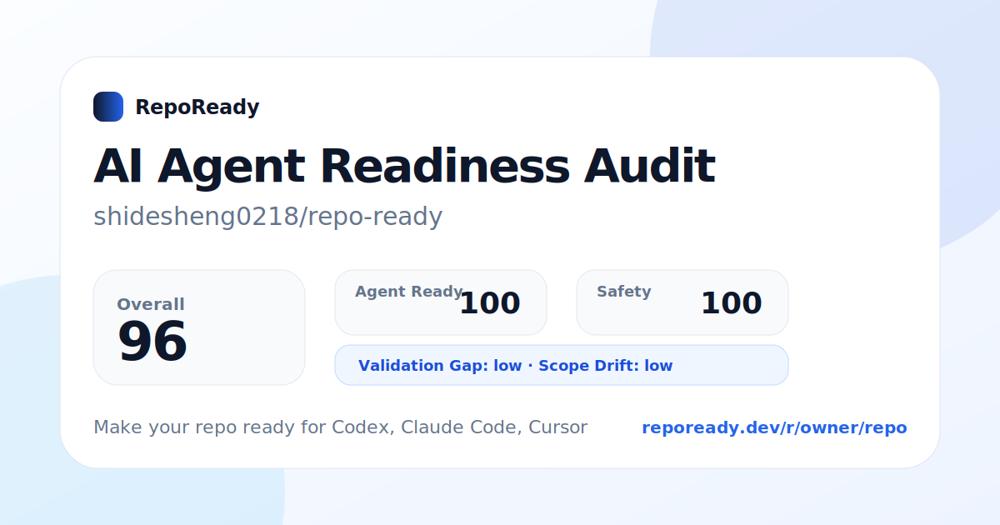

# RepoReady

[](https://www.npmjs.com/package/@shidesheng0218/repo-ready)


> **Make your repo ready for Codex, Claude Code, Cursor, and contributors.**
>
> **???????? Codex?Claude Code?Cursor ? AI ??????????????????**

RepoReady is an **AI Coding Agent Readiness Audit + Fix Platform**.

It scans a repository, explains why AI coding agents may fail, produces an audit-grade evidence chain, and generates reviewable fixes such as `AGENTS.md`, README improvements, GitHub Actions, templates, badges, `.gitignore`, and `.env.example`.

RepoReady ??????????????? AI ?????????? **preflight / readiness layer**????????????????????????? AI agent ?????????

---

## Quick Start

### macOS / Linux

```bash
npx @shidesheng0218/repo-ready@latest
```

### Windows

```powershell
npx.cmd @shidesheng0218/repo-ready@latest
```

### Chinese report

```bash
npx @shidesheng0218/repo-ready@latest --lang zh
```

### JSON / Markdown output

```bash
npx @shidesheng0218/repo-ready@latest --json
npx @shidesheng0218/repo-ready@latest --markdown
```

---

## Web Report Preview

Generate a public audit report for your repository:

```text
Paste GitHub URL -> Scan -> Review evidence -> Create Fix PR
```

Example share card:



If you deploy the web app yourself, the same route is available at:

```text
/share-card/[owner]/[repo].svg
/r/[owner]/[repo]
/badge/[owner]/[repo].svg
```

---

## Fix PR Preview

RepoReady can move from diagnosis to a reviewable patch or pull request.

```bash
npx @shidesheng0218/repo-ready@latest fix --plan
npx @shidesheng0218/repo-ready@latest fix --dry-run
```

Example PR body generated by RepoReady:

```md
## Why this PR exists

RepoReady detected that this repository is not fully ready for AI coding agents such as Codex, Claude Code, and Cursor.

## What RepoReady detected

- PASS / high Agent instructions detected - AGENTS.md
- REVIEW / medium README contribution guidance is missing - README.md

## Agent Failure Risks

- Validation Gap: agents cannot reliably verify their changes.
- Scope Drift: agents may edit the wrong module without clear boundaries.

## What this PR changes

### Safe automatic fixes
- AGENTS.md
- .env.example

### Review-required fixes
- README.md
- .github/workflows/repoready.yml

## What needs human review

Database, auth, payment, deployment, secrets, and destructive scripts remain manual-only.

## Validation

Suggested commands:
- npm test
- npm run build
```

---

## v0.5.0 Highlights

RepoReady v0.5.0 focuses on the public Web experience and the Fix PR workflow.

- **Premium Web homepage** for explaining the product clearly.
- **Audit-style report pages** at `/r/[owner]/[repo]`.
- **Improved Fix PR fallback** with patch preview, copy patch, download patch, and PR body preview.
- **Better share cards and badges** for GitHub README and social distribution.
- **Encoding cleanup** for Web copy, SVG output, and report separators.

## v0.4.0 Highlights

RepoReady v0.4.0 upgraded the product from a simple readiness scanner into a more credible **AI agent audit and fix platform**.

### Agent Failure Risk

RepoReady predicts where Codex, Claude Code, Cursor, or other coding agents are most likely to fail:

- **Context Confusion** - noisy repo context, generated files, missing ignore rules
- **Validation Gap** - missing test, build, lint, or check commands
- **Safety Boundary** - dangerous scripts, secrets, deployment, DB reset risks
- **Onboarding Gap** - weak README, unclear install / usage / contribution flow
- **Scope Drift** - missing `AGENTS.md`, `CLAUDE.md`, Cursor rules, or project boundaries

### Audit-grade Evidence Chain

RepoReady does not only show a score. It explains:

- what was detected
- where the evidence came from
- why it matters
- how to fix it
- whether the fix is safe, review-required, or manual-only

### Strategy Layer 2.0

RepoReady provides a strategic readiness brief:

- current posture
- risk level
- evidence confidence
- readiness gap
- priority actions
- automation boundary
- recommended path: now / next / later

---

## What RepoReady Checks

| Area | Checks |
|---|---|
| Agent instructions | `AGENTS.md`, `CLAUDE.md`, `.cursor/rules` |
| Validation | test, build, lint, check commands |
| README quality | install, usage, test, contributing, demo signals |
| CI / workflow | GitHub Actions, validation workflow |
| Contribution flow | issue template, PR template, contribution guide |
| Context quality | generated files, caches, large files, ignored folders |
| Safety | dangerous scripts, force push, DB reset, production deploys |
| Code quality | tests, lint/check scripts, lockfiles, CI signals |
| Agent task readiness | whether work can be split into safe, reviewable tasks |

---

## Scores

| Score | Meaning |
|---|---|
| **Agent Ready** | Can Codex / Claude Code / Cursor quickly understand and safely modify the repo? |
| **Contributor Ready** | Can a new human contributor install, run, test, and contribute? |
| **Context Quality** | Is the repository context clean and not overloaded by generated files? |
| **Safety** | Are scripts and workflows free from obvious high-risk operations? |
| **Code Quality** | Are there test, lint, check, and CI signals that make changes verifiable? |

---

## Fix Workflow

```bash
npx @shidesheng0218/repo-ready@latest fix --plan
npx @shidesheng0218/repo-ready@latest fix --dry-run
npx @shidesheng0218/repo-ready@latest fix --apply-safe
npx @shidesheng0218/repo-ready@latest fix --write
npx @shidesheng0218/repo-ready@latest fix --branch
npx @shidesheng0218/repo-ready@latest fix --pr --base main
```

`fix --pr` requires a git repository, a remote named `origin`, and GitHub CLI authenticated with `gh auth login`.

---

## Safety Principles

RepoReady is conservative by default.

- It does **not** execute repository scripts.
- It does **not** upload local private source code by default.
- It does **not** write files unless you explicitly request it.
- It does **not** merge PRs automatically.
- It flags dangerous scripts but does not run or rewrite them automatically.
- It treats deployment, database, payment, auth, and secrets as manual-review areas.

---

## Optional AI Enhancement

RepoReady works offline with a rules engine.

No API key means:

```text
No AI call.
No AI cost.
No source upload to AI providers.
```

Optional AI enhancement can be enabled by users who provide their own API key.

```bash
export OPENAI_API_KEY="sk-..."
export ANTHROPIC_API_KEY="sk-ant-..."
export REPOREADY_AI_KEY="openai:sk-..."
export REPOREADY_AI_MODEL="gpt-4o-mini"
```

---

## Agent Ready Spec

```bash
npx @shidesheng0218/repo-ready@latest spec
npx @shidesheng0218/repo-ready@latest spec --lang zh
```

See also:

```text
docs/agent-ready-spec.md
```

---

## Policy Layer

```bash
npx @shidesheng0218/repo-ready@latest policy init
npx @shidesheng0218/repo-ready@latest policy init --write
npx @shidesheng0218/repo-ready@latest policy check
npx @shidesheng0218/repo-ready@latest policy check --lang zh
```

---

## Agent Workflow Helpers

```bash
npx @shidesheng0218/repo-ready@latest doctor
npx @shidesheng0218/repo-ready@latest tasks
npx @shidesheng0218/repo-ready@latest context --dry-run
npx @shidesheng0218/repo-ready@latest context --write
```

---

## GitHub Action

```yaml
name: RepoReady

on:
  pull_request:
  push:

jobs:
  repoready:
    runs-on: ubuntu-latest
    steps:
      - uses: actions/checkout@v4
      - uses: ./packages/action
        with:
          language: en
          min-score: 70
```

---

## Cross-platform Support

RepoReady supports macOS, Windows, and Linux.

Requirements:

```text
Node.js >= 20
npm / npx
```

Windows users should prefer:

```powershell
npx.cmd @shidesheng0218/repo-ready@latest
```

PowerShell may block `npx.ps1` depending on execution policy.

---

## Local Development

```bash
git clone https://github.com/shidesheng0218/repo-ready.git
cd repo-ready
node packages/cli/bin/repoready.js
node packages/cli/bin/repoready.js --lang zh
node packages/cli/bin/repoready.js fix --dry-run
```

Run tests:

```bash
node --test
npm run lint
npm run web:build
```

Windows:

```powershell
node --test
npm.cmd run lint
npm.cmd run web:build
```

---

## Project Structure

```text
packages/core    scanning, scoring, reports, policy, spec, fix generation
packages/cli     local CLI, report output, fix workflow, PR workflow
packages/action  GitHub Action wrapper
apps/web         public report page, badge, share card, Fix PR flow
docs             Agent Ready Spec, Agent Ready Index, methodology docs
scripts          index scanning and report generation scripts
```

---

## Roadmap

- [x] Local repository scanner
- [x] Bilingual CLI reports
- [x] JSON and Markdown outputs
- [x] Evidence chain and score breakdown
- [x] Code Quality Score
- [x] Agent Failure Risk
- [x] Strategy Layer 2.0
- [x] Fix plan and safe-fix classification
- [x] Fix dry-run/write/branch/PR prototype
- [x] GitHub Action wrapper
- [x] Premium Web homepage
- [x] Audit-style public report pages
- [x] Badge and share-card routes
- [x] GitHub App Fix PR MVP with patch-preview fallback
- [x] Agent Ready Index MVP
- [ ] More language-specific rules
- [ ] Organization dashboard
- [ ] Repository trend history
- [ ] Enterprise policy packs

---

## Why This Matters

AI coding agents fail when repositories lack clear instructions, validation commands, clean context, and safety boundaries.

RepoReady turns those hidden risks into visible, explainable, fixable signals.

??????RepoReady ???????? AI ????????????????????????????????

---

## Links

- GitHub: https://github.com/shidesheng0218/repo-ready
- npm: https://www.npmjs.com/package/@shidesheng0218/repo-ready

---

## License

MIT
