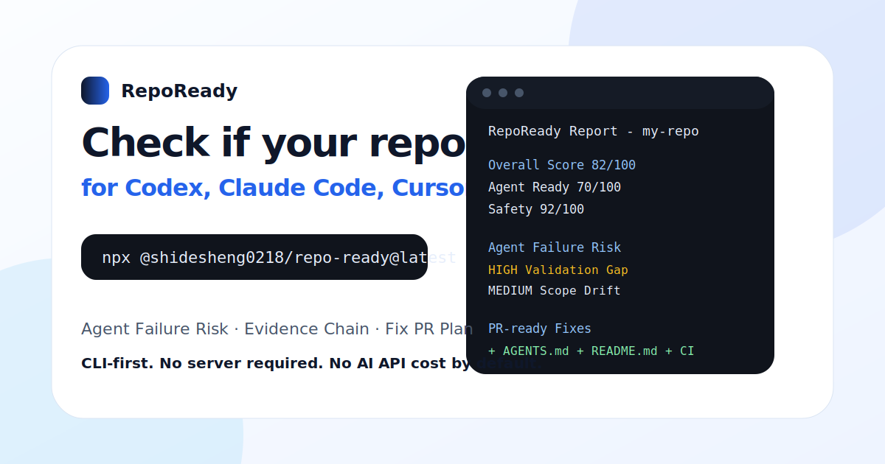

# RepoReady

[](https://www.npmjs.com/package/@shidesheng0218/repo-ready)


> **Make your repo ready for Codex, Claude Code, Cursor, and contributors.**
>
> **一行命令检查你的仓库是否适合 AI 编程代理协作。**

```bash
npx @shidesheng0218/repo-ready@latest
```



RepoReady is a **CLI-first AI coding agent readiness checker and fixer**. It scans your repository, explains why agents may fail, and generates a reviewable fix plan for `AGENTS.md`, README gaps, CI, templates, `.gitignore`, and `.env.example`.

RepoReady works locally by default. No server, no login, no AI API key, and no repository scripts are executed.

---

## Why developers use it

| Capability | What it gives you |
|---|---|
| **Agent Failure Risk** | Predicts why Codex, Claude Code, Cursor, or similar agents may fail in your repo. |
| **Audit Evidence Chain** | Shows the signals behind every score, not just a black-box number. |
| **Fix PR Plan** | Groups generated fixes into safe, review-required, and manual-only work. |

---

## Quick Start

### macOS / Linux

```bash
npx @shidesheng0218/repo-ready@latest
```

### Windows

```powershell
npx.cmd @shidesheng0218/repo-ready@latest
```

### Chinese report

```bash
npx @shidesheng0218/repo-ready@latest --lang zh
```

### Screenshot-friendly output

```bash
npx @shidesheng0218/repo-ready@latest --compact
npx @shidesheng0218/repo-ready@latest --screenshot
```

### Fix plan and dry run

```bash
npx @shidesheng0218/repo-ready@latest fix --plan
npx @shidesheng0218/repo-ready@latest fix --dry-run
```

---

## Example output

```text
RepoReady Report - my-repo

Overall Score        82/100
Agent Ready          70/100
Safety               92/100

Agent Failure Risk
HIGH     Validation Gap
MEDIUM   Scope Drift
LOW      Safety Boundary

Evidence Chain
PASS     AGENTS.md detected
PASS     Test command detected
REVIEW   README contribution section missing

PR-ready Fixes
+ AGENTS.md
+ README.md
+ .github/workflows/repoready.yml

Next
npx @shidesheng0218/repo-ready@latest fix --dry-run
```

---

## What RepoReady checks

| Area | Checks |
|---|---|
| Agent instructions | `AGENTS.md`, `CLAUDE.md`, `.cursor/rules` |
| Validation | test, build, lint, typecheck commands |
| README quality | install, usage, test, contribution, demo signals |
| CI / workflow | GitHub Actions and verification workflow |
| Context quality | generated files, caches, large files, ignored folders |
| Safety | dangerous scripts, force push, DB reset, production deploys |
| Code quality | tests, checks, lockfiles, CI, source structure |

---

## Fix workflow

RepoReady is conservative by default. It previews changes before writing.

```bash
npx @shidesheng0218/repo-ready@latest fix --plan
npx @shidesheng0218/repo-ready@latest fix --dry-run
npx @shidesheng0218/repo-ready@latest fix --apply-safe
npx @shidesheng0218/repo-ready@latest fix --write
npx @shidesheng0218/repo-ready@latest fix --branch
npx @shidesheng0218/repo-ready@latest fix --pr --base main
```

Fix groups:

| Group | Meaning |
|---|---|
| Safe automatic fixes | Low-risk files such as `AGENTS.md`, `.gitignore`, `.env.example` |
| Review-required fixes | README, CI, templates, workflow changes |
| Manual-only boundaries | database, auth, payment, deployment, secrets, destructive scripts |

`fix --pr` requires a git repository, a remote named `origin`, and GitHub CLI authenticated with `gh auth login`.

---

## Output formats

```bash
npx @shidesheng0218/repo-ready@latest --json
npx @shidesheng0218/repo-ready@latest --markdown
```

Use JSON for automation and Markdown for issue comments, GitHub Actions summaries, or reports.

---

## Optional web reports

RepoReady is CLI-first. The web report is optional and can be self-hosted.

You do **not** need a domain, server, database, OAuth, or GitHub App to use RepoReady locally.

Optional web capabilities:

```text
/r/[owner]/[repo]
/badge/[owner]/[repo].svg
/share-card/[owner]/[repo].svg
/api/fix-pr
```

These are useful later for public report pages, badges, share cards, GitHub App Fix PRs, and Agent Ready Index experiments.

---

## Safety and privacy

- RepoReady does **not** execute repository scripts.
- Local scans do **not** upload private source code by default.
- Files are only written when you explicitly use write/apply commands.
- Pull requests are reviewable and never merged automatically.
- Dangerous scripts are flagged, not executed.
- AI enhancement is optional. No API key means no AI call and no AI cost.

Optional AI configuration:

```bash
export OPENAI_API_KEY="sk-..."
export ANTHROPIC_API_KEY="sk-ant-..."
export REPOREADY_AI_MODEL="gpt-4o-mini"
```

---

## Agent Ready Spec and Policy

```bash
npx @shidesheng0218/repo-ready@latest spec
npx @shidesheng0218/repo-ready@latest spec --lang zh
npx @shidesheng0218/repo-ready@latest policy init
npx @shidesheng0218/repo-ready@latest policy check
```

See also:

```text
docs/agent-ready-spec.md
```

---

## GitHub Action

```yaml
name: RepoReady

on:
  pull_request:
  push:

jobs:
  repoready:
    runs-on: ubuntu-latest
    steps:
      - uses: actions/checkout@v4
      - uses: ./packages/action
        with:
          language: en
          min-score: 70
```

---

## Looking for contributors

Good first issues:

- Add Python framework detection rules
- Add Rust readiness checks
- Add Go project detection
- Improve dangerous script detection
- Improve README scoring for non-English projects

See `CONTRIBUTING.md` and `docs/launch-pack.md` for contribution and launch details.

---

## Local development

```bash
git clone https://github.com/shidesheng0218/repo-ready.git
cd repo-ready
node packages/cli/bin/repoready.js
node packages/cli/bin/repoready.js --compact
node packages/cli/bin/repoready.js fix --dry-run
```

Run checks:

```bash
node --test
npm run lint
npm run web:build
```

Windows:

```powershell
node --test
npm.cmd run lint
npm.cmd run web:build
```

---

## Roadmap

- [x] CLI repository scanner
- [x] English and Chinese reports
- [x] Agent Failure Risk
- [x] Audit Evidence Chain
- [x] Fix plan and dry-run patches
- [x] Screenshot-friendly CLI output
- [x] GitHub Action wrapper
- [x] Optional self-hosted web report
- [x] Launch pack and marketing assets
- [ ] More language-specific rules
- [ ] More framework detection
- [ ] Public Agent Ready Index
- [ ] GitHub App Fix PR production flow
- [ ] Organization dashboard

---

## Links

- GitHub: https://github.com/shidesheng0218/repo-ready
- npm: https://www.npmjs.com/package/@shidesheng0218/repo-ready

---

## License

MIT
